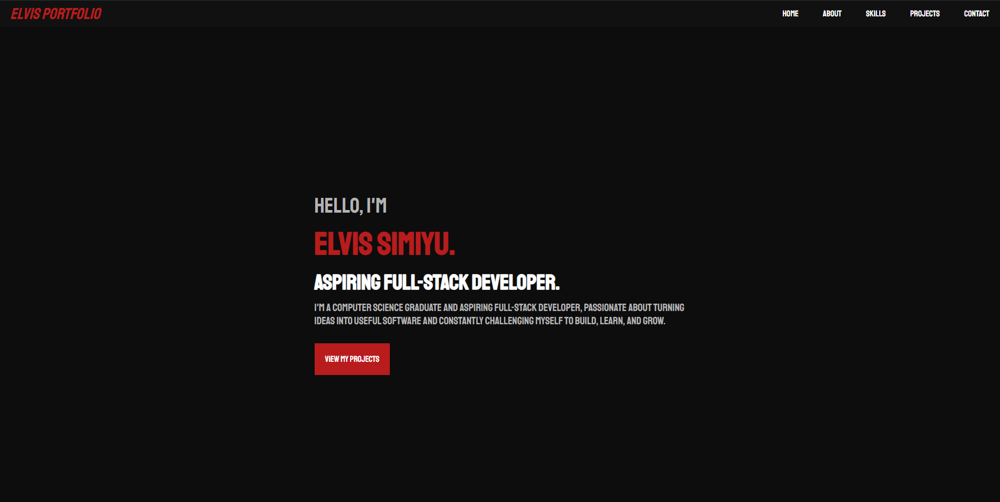
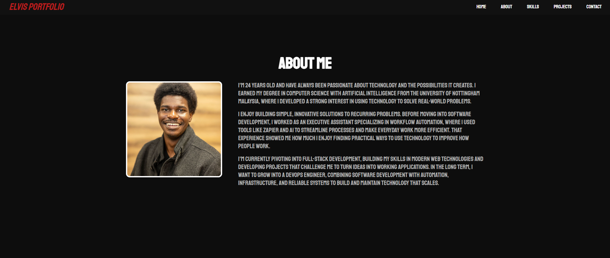
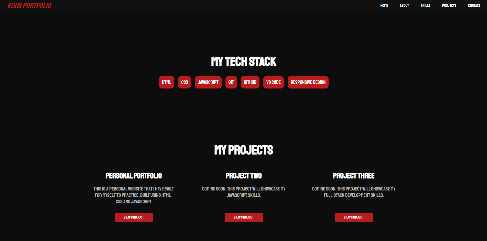
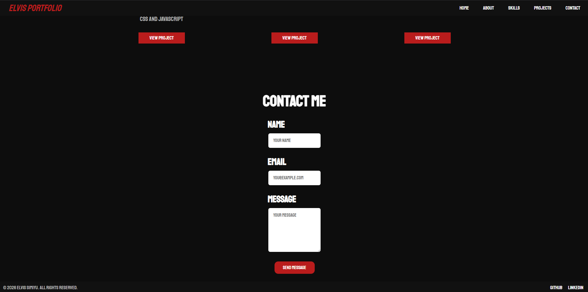

# elvis-portfolio
A personal portfolio website built with HTML and CSS to showcase my skills, projects, experience, and journey as a developer.
The website introduces who I am, my background, current technical skills, projects, and provides a way for visitors to get in touch.

## Live Website

[View the live portfolio](https://elvisxsimiyu.github.io/elvis-portfolio/)

## Technologies Used

- HTML5
- CSS3
- Flexbox
- Responsive Design
- Git & GitHub
- GitHub Pages
- Google Fonts

## Features

- Sticky navigation bar
- Hero section with introduction and call-to-action
- About Me section
- Personal profile image
- Skills / tech stack section
- Project cards
- Contact form
- Social media links
- Smooth scrolling navigation
- Responsive design for desktop, tablet, and mobile
- Hover effects and interactive styling

## Screenshots

### Hero Section

The landing section introduces me as an aspiring Full-Stack Developer.

### About Me

A section covering my background, education, experience, and career goals.

### Tech Stack & Projects

A display of my current technical skills alongside my projects.

### Contact

A simple contact form where visitors can enter their name, email, and message.

## Project Structure

elvis-portfolio/
│
├── index.html
├── style.css
│
├── screenshots/
│   ├── hero.png
│   ├── about_me.png
│   ├── stack_projects.png
│   └── contact_me_page.png

## Purpose

This project was created as part of my web development learning journey.

The goal was to apply the fundamentals of HTML and CSS to build a complete website from scratch while practicing:

- Semantic HTML
- CSS layouts
- Flexbox
- Responsive design
- Navigation and anchor links
- Forms
- Git version control
- GitHub Pages deployment

This portfolio is intended to grow alongside my skills throughout my development journey. As I build more projects, I will continue adding them here.

## Future Improvements

As I continue learning, I plan to improve the portfolio by adding:

- More projects
- JavaScript functionality
- Improved animations and interactions
- A dark/light theme toggle
- More detailed project pages
- Additional responsive improvements

## About Me

I'm a Computer Science graduate with a background in Artificial Intelligence, currently transitioning into Full-Stack Development.

I enjoy building simple, innovative solutions to recurring problems and exploring how technology can make everyday processes more efficient.

My long-term goal is to become a DevOps Engineer, combining software development, automation, infrastructure, and reliable systems.

## License

This project was created for educational and portfolio purposes.